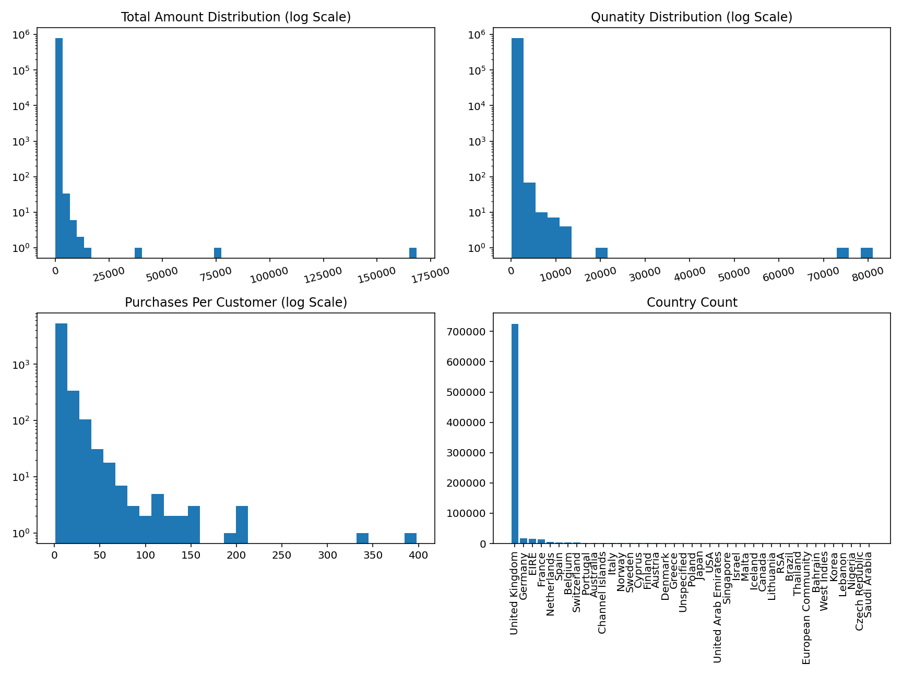
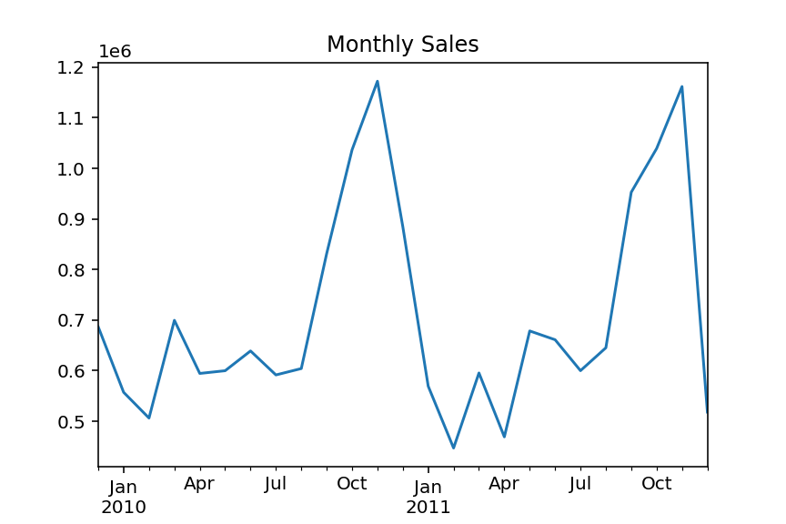
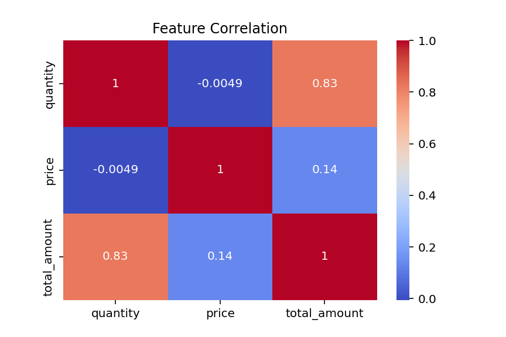

# 30-Day-Churn-Prediction
A 30-day advance customer churn prediction system using XGBoost with dominant driver analysis for high-LTV customers. Precision improved from 0.525 → 0.843 and AUC from 0.722 → 0.746 (time-split validation). Enables targeted, ROI-driven retention campaigns.

[](https://www.python.org/)
[](https://xgboost.ai/)
[](https://opensource.org/licenses/MIT)

---

## 🚀 Project Overview

This project predicts which **loyal customers** (≥2 purchases in the past 90 days) will **not purchase again in the next 30 days**, enabling **proactive retention campaigns** and **ROI-driven decision-making**.

- **Dataset:** [Online Retail II](https://archive.ics.uci.edu/ml/datasets/Online+Retail+II) (UCI ML Repository)  
- **Algorithm:** XGBoost Classifier (hyperparameter-tuned)  
- **Validation:** June–July → August 2011 (time-based split, no data leakage)  
- **Key Metric:** Precision @ Top 10% = **0.843**, AUC = **0.746**

> 🎯 **84.3% of flagged customers actually churned** — only **1 in 6.3 interventions** was unnecessary.

---

## 💼 Business Impact

| Metric | Value | Description |
|--------|-------|-------------|
| **Precision @ Top 10%** | **0.843** | 84.3% of flagged customers churned |
| **AUC** | **0.746** | Strong overall ranking power |
| **True churners saved (per 1,000)** | **843** | Estimated recoveries from retention actions |
| **Net profit (at $200 CLV, $5 cost)** | **$163,600** | Profit from targeted retention |
| **ROI** | **32.7×** | **$32.70 profit per $1 spent** |

> 💰 *Every dollar spent on retention returns $32.70 in saved revenue.*

---

### Screenshots




---

## 🧠 Dominant Churn Driver Identification
Each churned customer is categorized by likely cause:
- `price` → Spend drop or discount sensitivity  
- `quality` → Low average basket value  
- `adoption` → Few repeat orders  
- `competition` → Normal spend but inactive later  

This enables **personalized retention actions**:
| Driver | Recommended Action |
|---------|--------------------|
| price | Offer targeted discounts |
| quality | Highlight premium products |
| adoption | Send onboarding or reactivation nudges |
| competition | Launch loyalty rewards |

---

## How It Works

1. **Data Cleaning**  
   - Remove missing `Customer ID`, negative `Quantity`/`Price`  
   - Create `total_amount = Quantity × Price`

2. **Snapshot-Based Labeling (June, July, August 2011)**  
   - **Observation Window**: 90 days before snapshot  
   - **Prediction Window**: 30 days after snapshot  
   - **Label**: `churn = 1` if no purchase in next 30 days

3. **Feature Engineering**  
   - `avg_basket`, `invoice` count, `spend_drop` (early vs late 45-day split)  
   - `total_spend` (lifetime), `country`, `driver` (heuristic: price, quality, adoption, competition)  
   - `high_ltv` flag (top 2% spenders)

4. **Modeling**  
   - XGBoost with `scale_pos_weight` for class imbalance  
   - Hyperparameter tuning (commented in notebook)  
   - Final model: `n_estimators=200`, `max_depth=5`, etc.

5. **Validation**  
   - **Time-split**: Train on June/July → Test on August  
   - **Result**: Precision @ 10% = **0.843**, AUC = **0.746**

---

## How to Run

1. **Clone repo:**
   ```bash
   git clone https://github.com/yourusername/30-day-churn-prediction.git
   cd 30-day-churn-prediction

2. **Create virtual environment:**
   ```bash
   python -m venv venv
   source venv/bin/activate  # Linux/Mac
   or
   venv\Scripts\activate     # Windows

3. **Install dependencies:**
   ```bash
   pip install pandas numpy scikit-learn xgboost joblib jupyter

4. **Run notebook:**
   ```bash
   jupyter notebook churn_prediction.ipynb

---

## Requirements

All project dependencies are listed in the requirements.txt file.
You can install them with the following command:
   ```bash
   pip install -r requirements.txt
```
This will automatically install all required libraries (e.g., pandas, numpy, scikit-learn, xgboost, joblib, jupyter) to reproduce the analysis and results.

---

## Example Code

   ```bash
   import joblib
   import pandas as pd
   
   model = joblib.load("30_day_churn_model_v1.pkl")
   features = joblib.load("model_features_v1.pkl")
   
   # X_new: DataFrame with same features as training
   X_new = X_new[features]  # Ensure column order & one-hot encoding
   proba = model.predict_proba(X_new)[:, 1]
   threshold = np.percentile(proba, 90)
   X_new['churn_risk'] = proba
   X_new['action_required'] = proba >= threshold

   ```

 ---

## 👤 Author
**Aniket Walunj**  
Data Science Enthusiast | Machine Learning & Survival Analysis Project 
[LinkedIn](https://www.linkedin.com/in/aniket-walunj-93a07864/)
[GitHub](https://github.com/walunjaniket)

## License
MIT License – Free to use, modify, and distribute.

Built with 💻 and ☕ in 2025
